# Drip-算法全生命周期管理工具

       


## 介绍
+ Drip介绍
  + Drip设计说明
  + Drip是一个轻量的生产级算法平台，覆盖从算法实验、算法运行前管理、算法运行时管理到算法运行后管理的全生命周期。**Drip的核心概念包括信息管理、存储管理、日志管理、调度管理、特征管理、数据通道和插件管理。**
  + Drip每个核心功能都由独立模块支持，完全可单独使用。
  + Drip设计架构图
    + **逻辑视图**
    + 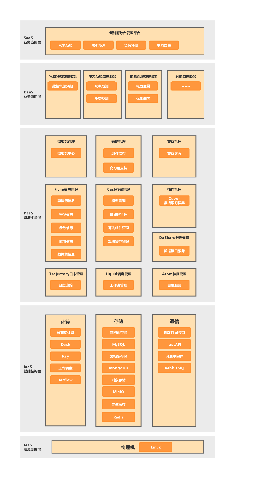
    + **物理视图**
    + 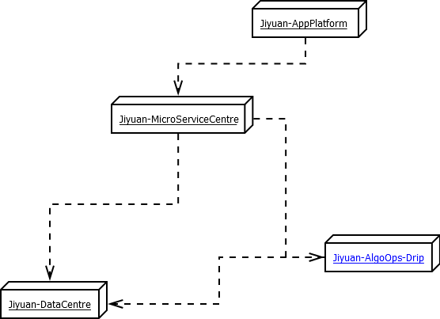
    + **处理视图**
    + 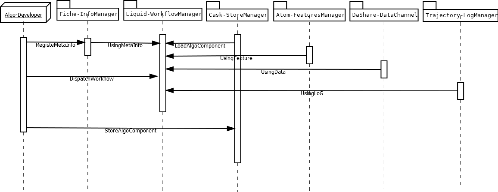
    + **开发视图**
    + 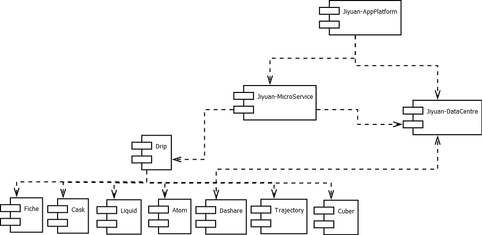

## 安装
```bash
$ pip install drip-0.1-xxxxxxxxxxxx.whl
```

## 快速指南
+ 首先使用dripctl命令行工具进行管理员注册操作，然后启动webui后台服务。另外，后端详细配置在drip_config.yaml中。以下是dripctl命令行示例：
```bash 
$ dripctl create-admin

$ dripctl start-webui
```
+ Drip算法研发流程
+ 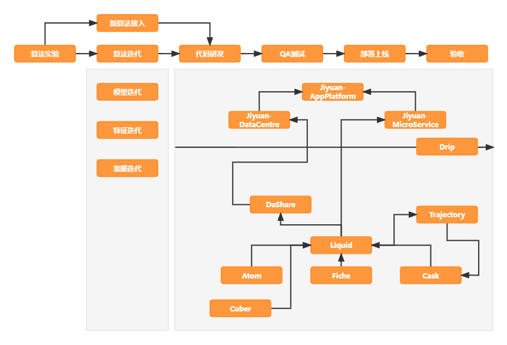
+ 以下为DripWebUI使用界面
+ 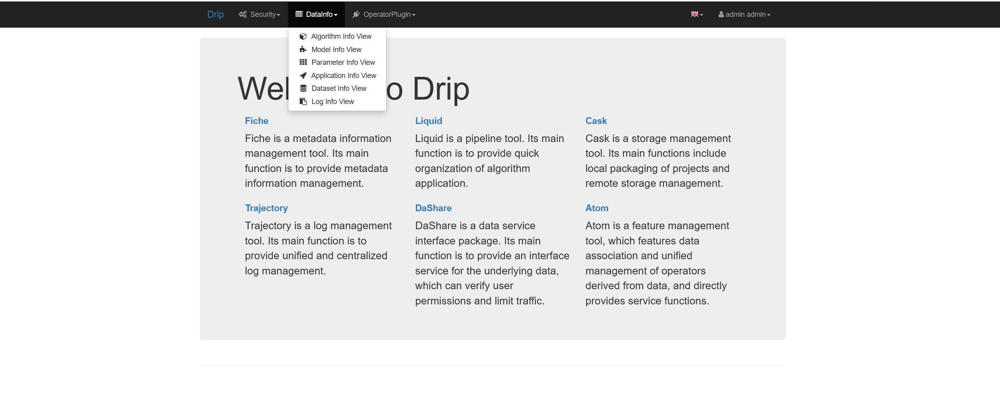
+ 

## 设计
+ Drip核心模块介绍
  + 信息管理：[Fiche](https://github.com/redblue0216/Fiche)
    + 设计说明
    + Fiche是一个元数据信息管理工具，主要功能提供元数据信息的管理，包括算法信息、模型信息、参数信息、应用信息和数据信息五大类信息；主要设计采用将信息卡片化，存储为一个个json字符串文档，采用主从推送模型实现观察者模式，便于信息中心化；主要技术采用MongoDB作为后端信息数据的中心存储，基于FastAPI实现的http服务使得该工具提供python-sdk的同时也与语言无关。
    + 设计架构图
    + 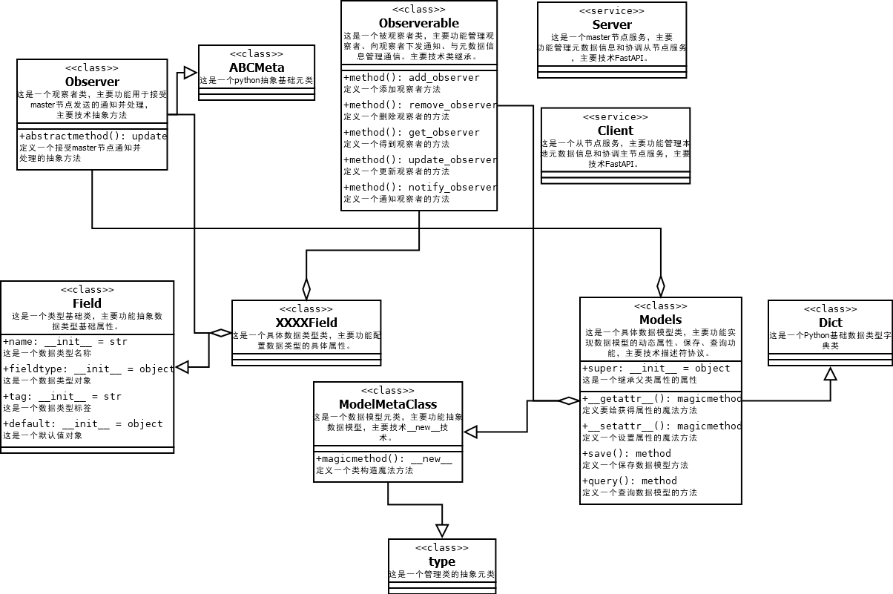
  + 存储管理：[Cask](https://github.com/redblue0216/Cask)
    + 设计说明
    + cask是一个存储管理工具，主要功能包括项目本地打包，远端存储管理两大功能，主要设计仿制wheel文件格式，远端存储采用MinIO技术。
    + 设计架构图
    + 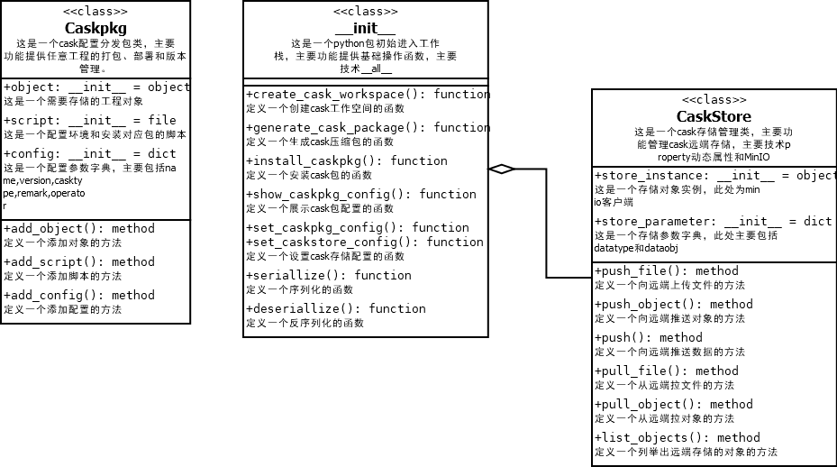
  + 调度管理：[Liquid](https://github.com/redblue0216/Liquid)
    + 设计说明
    + liquid是一个pipeline工具，主要功能提供算法应用快捷组织功能，主要技术使用基于pluggy的hook技术。
    + 设计架构图
    + 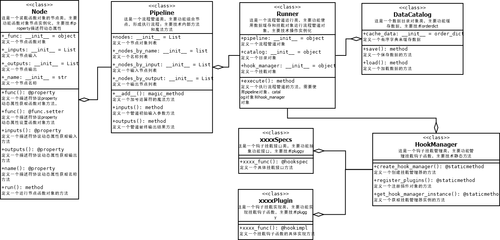
  + 日志管理：[Trajectory](https://github.com/redblue0216/Trajectory)
    + 设计说明
    + trajectory是一个日志管理工具，主要功能提供日志统一集中管理功能，主要技术基于logging提供一个mongodb的日志转发器，包括日志过滤、日志格式化功能。
    + 设计架构图
    + 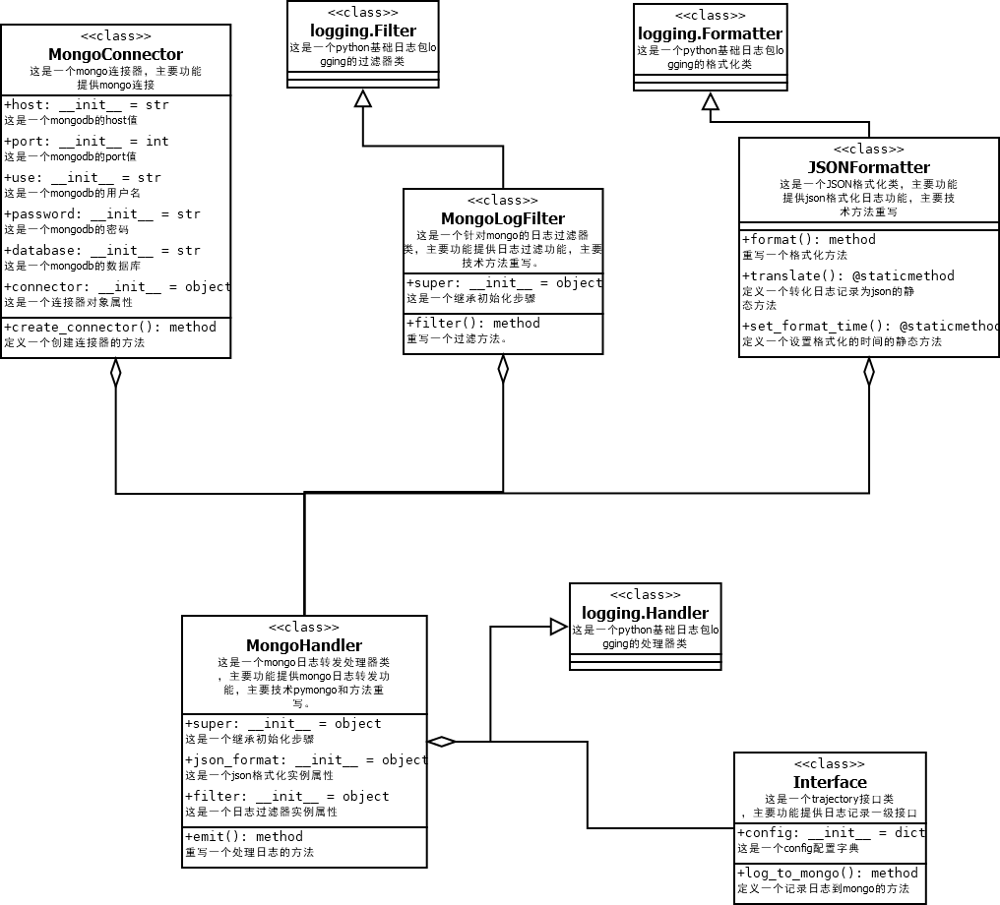
  + 数据通道：[DaShare](https://github.com/redblue0216/DaShare)
    + 设计说明
    + DaShare是一个数据服务接口包，主要功能是为底层数据向外提供了一个接口服务,可实现用户权限验证和流量限制。DaShare采用Client-Server架构设计，服务端使用HTTP协议构建数据服务的OpenAPI,暂时采用GET-method,客户端封装为python-sdk,提供python数据接口功能；用户权限采用token机制。
    + 设计架构图
    + 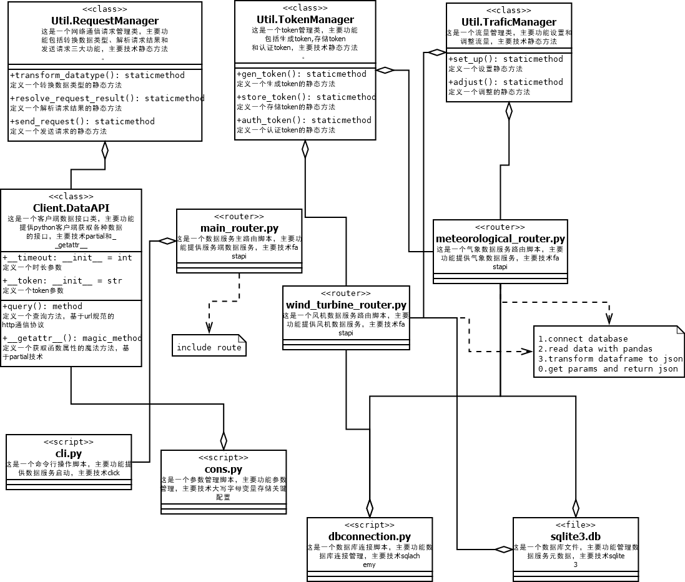
  + 特征管理：[Atom](https://github.com/redblue0216/Atom)
    + 设计说明
    + Atom是一种特征管理工具，以数据和算子作为基本概念，数据为基础数据用于训练特征和构建特征；算子为基于固定一个或多个数据集进行新特征生产的流程，可以是一个简单直接计算函数，也可以是一个复杂的算法模型，还可以是算法模型和直接计算相结合的组合体。atom的特色是对由数据衍生的算子进行了数据关联、统一管理，并直接提供了服务功能，使得每个算子可以直接实现在线实时计算特征，为主体算法模型服务，提高模型精度。
    + 设计架构图
    + 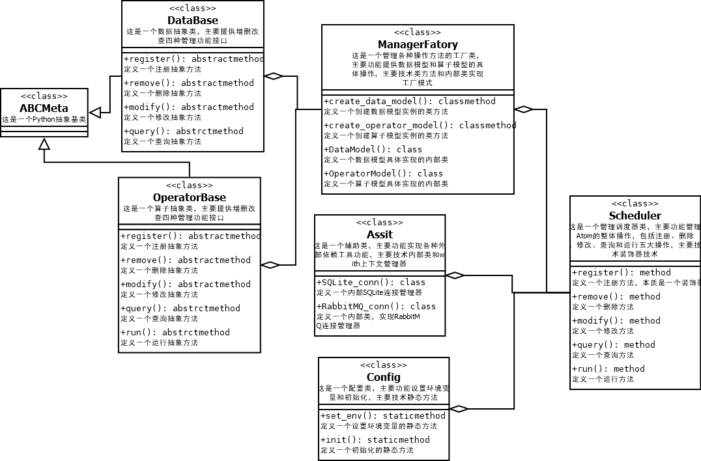


